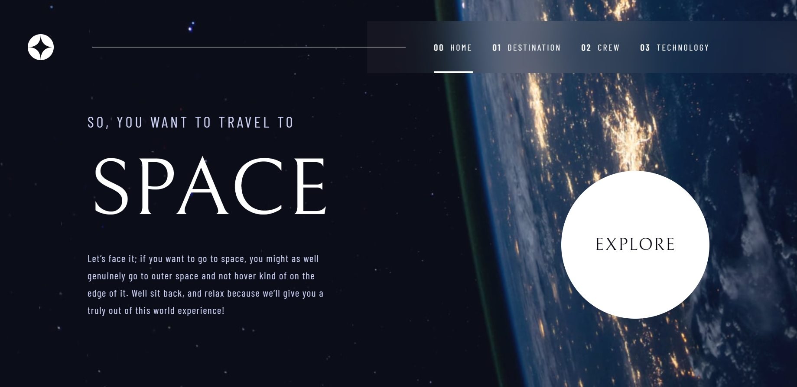

# space-tourism-website




<br>

## 📎 Sumário
- 📌 Resumo do Projeto
- 🛠️ Abrir e rodar o projeto
- ⭐ Features
- 📂 Temas abordados
- ✔️ Tecnologias Utilizadas
- 💻 Demonstração
- 🙋🏻‍♂️ Autor

<br>

## 📌 Resumo do Projeto
Um site incrível sobre turismo espacial feito com React e hospedado no Netlify. Design moderno e responsivo, com informações interessantes sobre destinos, tripulação e tecnologia espacial.

<br>

## 🛠️ Abrir e rodar o projeto
Para Rodar o projeto em sua máquina, dentro da pasta raiz do projeto, execute o comando abaixo no terminal, para a instalação das depêndencias:
```
npm install
```
Após a instalação do projeto, execute o comando abaixo para inicializar o projeto:
```
npm run dev
```

<br>

## ⭐ Features

- Site sobre turismo espacial, tema inovador e atraente.

- Quatro páginas principais: Home, Destination, Crew e Technology, com informações sobre o turismo espacial.

- Design moderno e elegante, seguindo o modelo do desafio do Frontend Mentor. Cores escuras e contrastantes, fontes estilizadas e imagens de alta qualidade.

- Site responsivo e adaptável a diferentes tamanhos de tela. Menu hamburguer para navegação em telas menores.

- Site feito com React, framework popular e poderoso para interfaces de usuário. Componentes reutilizáveis, hooks e rotas para organizar o código e melhorar a experiência do usuário.

- Site hospedado no Netlify, plataforma de hospedagem gratuita e fácil de usar para sites estáticos.

<br>

## 📂 Temas abordados
- React
- Rotas
- SPA
- Componentes
- Hooks
- CSS
- Media queries
- Responsividade

<br>

## ✔️ Tecnologias Utilizadas


<br>

## 💻 Demonstração
Para visualizar uma prévia do projeto <a href="https://turismo-espacial.netlify.app/"><b>clique aqui</b></a>

<br>

## 🙋🏻‍♂️ Autor

| [<br><sub>Bruno Oliveira</sub>](https://github.com/BrunoOliveira16) |
| :---: |
